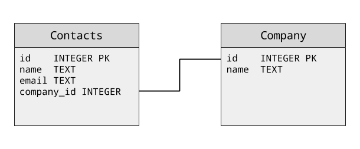

# SQL Tutorials

**This repository includes two brief tutorials on SQL with Python (using SQLite) to create databases and to execute joins**

## Tutorial 1: Creating Databases using `sqlite`

In this tutorial, we'll explore how to build a simple contacts application, since we're all familiar with it. This will help to show you how to build larger databases and perform data management with them.

If you'd like to work directly with the Jupyter Notebook, you can clone this repository, download the zip, or simply download the IntroDBWorkshop.ipynb file. Once you have it, you can run Jupyter notebook as follows:

    $ jupyter notebook IntroDBWorkshop.ipynb

Note if you don't have Jupyter, you can pip install it:

    $ pip install jupyter

Otherwise, you can simply create a Python file in your local directory and add the code from the notebook as you work through it.

Sample solutions for this lab are in the IntroDBWorkshop_answers.ipynb file.

## Tutorial 2: Heroic Joins with SQL

In this tutorial, we'll explore how to use SQL joins to perform more complex queries on a database. This will help to show you how to interact with databases and perform general analytics with them. We'll also start to see some of the limitations of `sqlite` and explore some of the more robust options.

If you've already cloned this repository you can run the Jupyter notebook as follows:

    $ jupyter notebook IntroSQLJoins.ipynb

You can also download the zip or simply download the IntroSQLJoins.ipynb file. Once you have it, type this into your terminal:

    $ jupyter notebook IntroSQLJoins.ipynb

Otherwise, you can simply create a Python file in your local directory and add the code from the notebook as you work through it.

Sample solutions for this lab are in the IntroSQLJoins_answers.ipynb file.
